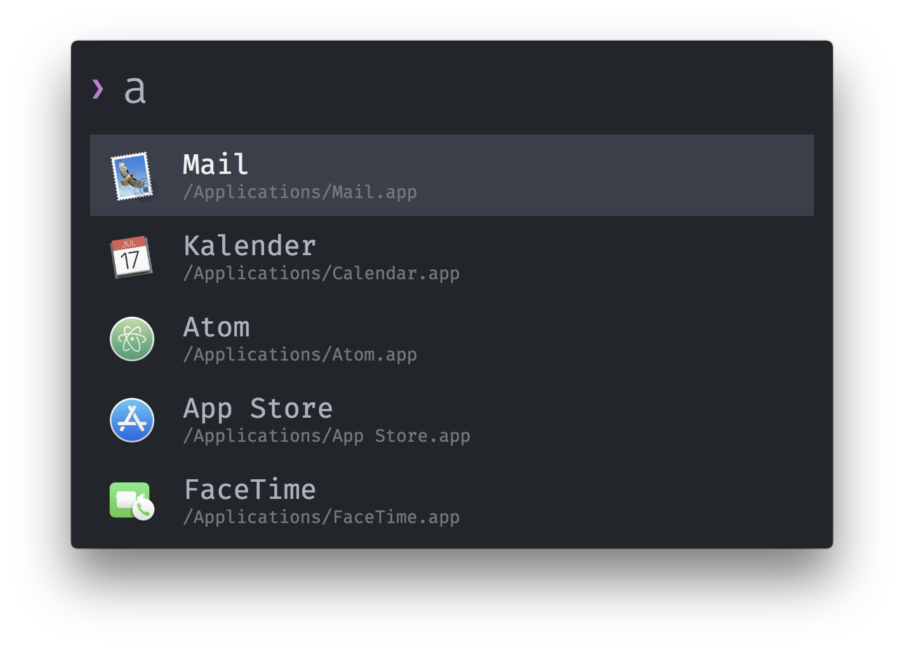

# zazu-one-dark-theme

> A simple dark theme for [Zazu App](https://github.com/tinytacoteam/zazu) inspired by [One dark UI](https://github.com/atom/one-dark-ui) and [Pure](https://github.com/sindresorhus/pure).

[](https://travis-ci.org/marco-streng/zazu-one-dark-theme)



## Install

Add `marco-streng/zazu-one-dark-theme` as value to `theme` inside of your `~/.zazurc.json` file.

```json
{
  "theme": "marco-streng/zazu-one-dark-theme"
}
```

## License

Copyright (c) 2018 Marco Streng. See [LICENSE](./LICENSE.md) for details.
